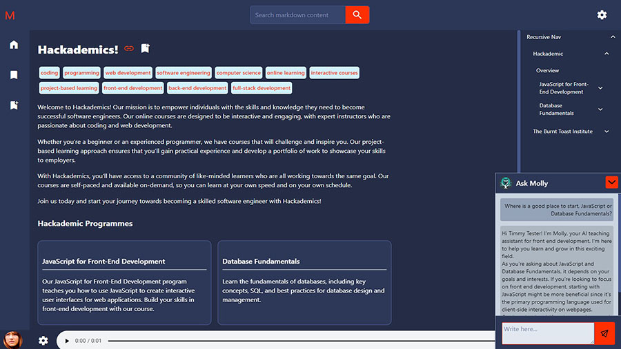

# -mollify



Mollify is a dynamic Learning Management System (LMS) designed to provide a user-friendly interface for managing and navigating markdown content. The platform offers a multitude of features, including content navigation, search capabilities, bookmarking, text-to-speech functionality, an AI assistant, and a markdown editor with 'What You See Is What You Get' (WYSIWYG) capabilities.

## Description

Mollify, divided into various packages within a Lerna monorepository, primarily consists of the LMS and CLI. These modules empower users to manage their content efficiently and transform it into a navigable webpage.

### Mollify LMS Package

The Mollify LMS package is the frontend of the Mollify project, constructed using Sveltekit, TypeScript, Tailwind, Skeleton UI, and MDsveX. The aim is to convert markdown content into an accessible website, enabling users to navigate, search, and bookmark content effectively, along with additional feature integration. The ultimate goal is to allow users to install the LMS package, migrate their existing content or create new, and finally, present it as a website.

### Mollify CLI Package

Mollify CLI is a command-line tool designed to manage the filesystem for the Mollify Learning Management System (LMS). It ensures that the file structure adheres to SvelteKit's file path conventions and provides a convenient way to create, archive, and remove various entities within the LMS. Mollify CLI is written in TypeScript and uses the Commander and Enquirer libraries to provide a user-friendly and intuitive interface.

### Mollify Molly Package

Mollify Molly is an OpenAI-powered teaching assistant, designed to answer student queries by accessing the lesson content.

### Mollify TTS Package

Mollify Text-To-Speech provides audio for markdown content, enabling users to generate and listen to the content. Currently leveraging ElvenLabs for TTS, future plans may include various optional TTS packages to offer a more flexible user experience.

### Mollify Flow Package

Mollify Flow offers a user interface for the CLI package, enabling users to create, update, and manage content. It includes a WYSIWYG editor for real-time content preview and update tracking.

### Mollify Types Package

Mollify Types package is home to all TypeScript types and definitions for easy import into any of the Mollify packages.

## Stack

These are a some of the core dependencies although many more are present.

- Lerna
- Sveltekit
- TypeScript
- Tailwind
- Skeleton UI
- Vite

## Getting Started

### Installing

1. Clone the repo:

```bash
git clone https://github.com/Fermain/-mollify.git
```

2. Install the dependencies:

```
npm install
npx lerna bootstrap
```

3. Create a .env in the LMS package root

```
OPENAI_API_KEY=YOUR_KEY
OPENAI_TOKEN_LIMIT=1000
ELEVENLABS_API_KEY=YOUR_KEY
```

### Usage

To run the LMS you can use this command from the root, alternatively you can run this on the Molly and Flow branches.

```bash
npx lerna run dev --scope @mollify/lms
```

### Future Implementation

A future goal is for users to simply run the following command to automatically install Mollify and its dependencies:

```
npm i @mollify/LMS
```

Then create a content folder with markdown files using the Flow editor, or migrate existing content using

```
npx mollify migrate
```

Then a user will be prompted to answer questions relating to the front matter of the content so it can be indexed and run as a website.

## Contributing

Create a fork, find an issue to work on and submit a pull request with your contribution.

## Contact

[](https://github.com/Fermain)

## License

Copyright 2023 Oliver Dipple

Licensed under the Apache License, Version 2.0 (the "License");

http://www.apache.org/licenses/LICENSE-2.0

## Acknowledgments

Project Lead

- Oliver Dipple [Fermain](https://github.com/Fermain)

Collaborators

- Alexander Barrett [Anclagen](https://github.com/Anclagen)
- Eric Pretzinger [pretzL](https://github.com/pretzL)
- Jenny Feragen [jenfer93](https://github.com/Jenfer93)
- Melisa Zorraindo [Melisa-Zorraindo](https://github.com/Melisa-Zorraindo)
